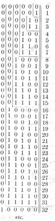

Partir desde cero
-----------------

Cuando nos enseñan a contar en la escuela lo hacen a partir del uno: 1, 2, 3… Si hay una hilera de personas empezamos a contarlas desde 1. Por eso que los matemáticos tienen el conjunto de los números naturales que empieza desde 0: N = {1, 2, 3, 4…..}. Pero en computación las cosas empiezan desde cero.

Según `Wikipedia <http://es.wikipedia.org/wiki/Cero>`_: “La palabra «cero» proviene de la traducción de su nombre en sánscrito shunya (vacío) al árabe sifr (صفر), a través del italiano. La voz española «cifra» también tiene su origen en sifr.”

El cero, el valor nulo, la ausencia de algo, el origen, el primero de los números binarios, esa será nuestra primera cifra. La segunda cifra será el 1. Y no necesitamos más.

0 y 1 son suficientes.

El gran matemático Leibnitz lo `explicó así <http://www.leibniz-translations.com/binary.htm>`_ en 1703: ::

	El ajuste de cuentas común de la aritmética está hecho de acuerdo a la progresión de las decenas. 
	Diez caracteres son usados, los que son 0, 1, 2, 3,  4, 5, 6, 7, 8, 9, los que denotan al cero, uno 
	y los números sucesivos hasta el nueve inclusive. Y luego, cuando alcanzamos diez, el uno empieza de
	nuevo, escribiendo diez como “10″, diez veces diez, o cien, como “100″, diez veces cien, o mil, como
	“1000″, diez veces mil como “10000″, y así.

	Pero en vez de la progresión de diez, he usado por muchos años la más simple progresión de todas, la
	que se incrementa por dos, habiendo encontrado que es útil para la perfección de la ciencia de los 
	números. Así que no uso otros caracteres que el 0 y el 1, y cuando llego al dos, empiezo de nuevo. 
	Esto es porque el dos es expresado por “10″, y dos veces dos, o cuatro, por “100″, dos veces cuatro, 
	u ocho, por “1000″, dos veces ocho, o dieciseis, por “10000″, y así. Aquí está la tabla de los números
	de esta manera, la cual puede ser extendida tan lejos como se desee.

	Aquí, de un vistazo se hace evidente la razón para una celebrada propiedad de la progresión geométrica 
        de los dos en todos los números, la que establece que si uno tiene sólo uno de esos número por cada 
	grado, se pueden componer todos los números por debajo del grado más alto. De aquí, si uno ha dicho, 
	por ejemplo, que 111, ó 7, es la suma de cuatro, dos y uno, y que 1101, ó 13, es la suma de ocho, 
	cuatro y uno. Esta propiedad permite a los ensayadore pesar todo tipo de masas con pocos pesos y podría 
	servir para acuñar de modo de obtener muchos valores con pocas monedas.
	
	Estableciendo estas expresiones de número nos permiten hacer todo tipo de operaciones muy fácilmente.

.. sidebar:: Tabla de numeros binarios de Leibniz (año 1703)

               
   La tabla de los números binarios de Leibniz (año 1703)

